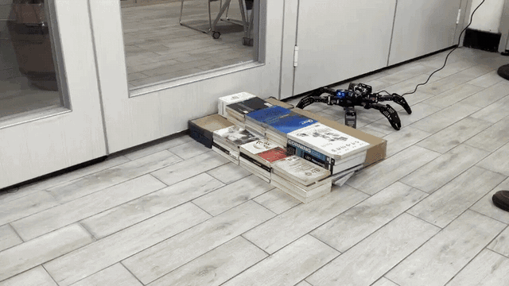

# Hybrid CPG + Reinforcement Learning Gait Control for a Hexapod Robot

**基於 CPG 與強化學習混合架構之六足機器人步態控制**

<p align="center">
  
</p>
<p align="center"><i>Real-robot stair traversal on a Hiwonder SpiderPi (18-DOF) hexapod.</i></p>

---

## Overview

This repository contains the NVIDIA Isaac Lab project for our hexapod locomotion research, targeting low-cost legged platforms for search-and-rescue scenarios.

A **Central Pattern Generator (CPG)** with inverse kinematics produces a periodic tripod gait as a trajectory prior, and a **PPO** policy learns **residual corrections** on top of it:

```
joint target = CPG(phase) + w_RL · π_PPO(observation),   w_RL = 0.1
```

The CPG prior keeps training fast and stable, while the learned residual compensates for the prior's limitations in heading control and postural balance, allowing the robot to adapt to rough terrain and stairs.

The work was published at **ARIS 2026** (International Conference on Advanced Robotics and Intelligent Systems, IEEE) and is supported by an **NSTC undergraduate research grant** (115-2813-C-003-029-E).

## Highlights

- **IK-based CPG controller**: tripod / wave gaits, vectorized on GPU (`spider_ik_cpg.py`)
- **Three comparable tasks** for a fair ablation: `SpiderPureCPG`, `SpiderPureRL`, `SpiderHybrid`
- **Diverse terrains**: flat, random rough, and stair terrains (including a custom one-way stair terrain)
- **Sim-to-real pipeline**: a privileged teacher (with height scan) is distilled into a proprioceptive student policy for real-hardware deployment (`collect_teacher_data.py`, `train_student.py`, `dagger_label.py`, `deploy_student.py`)
- **Evaluation tools**: multi-terrain evaluation (`eval_terrain.py`, `run_eval.sh`) and locomotion metrics (`metrics.py`)

## Results

Locomotion metrics during policy evaluation in simulation (ARIS 2026, Table II):

| Metric | Pure RL | **Hybrid (CPG + RL)** | Δ |
|---|---|---|---|
| Body orientation RMS ↓ (rad) | 0.136 | **0.082** | −39.7% |
| Cost of transport ↓ | 30.551 | **25.514** | −16.5% |
| Foot slip rate ↓ (m/s) | 0.095 | **0.081** | −14.7% |

The Hybrid policy also converges faster and more stably than pure RL. On hardware, the trained policy runs on the physical SpiderPi, achieving stable locomotion on uneven indoor terrain and stair traversal (see GIF above).

## Hardware

| Component | Details |
|---|---|
| Robot | Hiwonder SpiderPi hexapod, 18 DOF |
| Actuators | 18 × LX-224 serial bus servos |
| IMU | MPU6050 |
| Control | Arduino Uno + servo controller board, PC host (Python / PyTorch) over USB serial |

## Repository Structure

```
source/spider/spider/tasks/manager_based/spider/
├── spider_ik_cpg.py              # IK-based CPG action term (tripod / wave gait)
├── spider_env_cfg_hybrid.py      # Hybrid CPG + RL environment
├── spider_env_cfg_pure_cpg.py    # Pure CPG baseline
├── spider_env_cfg_pure_rl.py     # Pure RL baseline
├── mdp/                          # Custom observations and rewards
├── metrics.py                    # Locomotion metrics (orientation RMS, CoT, foot slip)
└── agents/                       # skrl PPO configs for each task
scripts/
├── skrl/train.py, play.py        # Training and playback
├── skrl/eval_terrain.py          # Multi-terrain evaluation
├── skrl/collect_teacher_data.py  # Teacher rollouts for distillation
├── skrl/train_student.py         # Student policy training
├── skrl/dagger_label.py          # DAgger relabeling
└── skrl/deploy_student.py        # Real-robot deployment
```

## Getting Started

1. Install [Isaac Lab](https://isaac-sim.github.io/IsaacLab/main/source/setup/installation/index.html), then install this extension in editable mode:

   ```bash
   python -m pip install -e source/spider
   ```

2. List the available tasks:

   ```bash
   python scripts/list_envs.py
   ```

3. Train a policy (for example, the Hybrid task):

   ```bash
   python scripts/skrl/train.py --task SpiderHybrid --headless
   ```

4. Play a trained checkpoint:

   ```bash
   python scripts/skrl/play.py --task SpiderHybrid --checkpoint <path/to/checkpoint.pt>
   ```

## Publication

P.-T. Chen, H.-H. Huang, Y.-C. Liao, and S.-Y. Chen, "Hexapod Gait Control Using Reinforcement Learning with Central Pattern Generator," in *Proc. 2026 International Conference on Advanced Robotics and Intelligent Systems (ARIS 2026)*, Tainan, Taiwan, Aug. 2026.

## Acknowledgements

- Advisor: Prof. Syuan-Yi Chen, Department of Electrical Engineering, National Taiwan Normal University
- Team: Pei-Ting Chen, Hsuan-Hsiang Huang, Yung-Chieh Liao
- Supported by the National Science and Technology Council (NSTC), Taiwan, undergraduate research grant 115-2813-C-003-029-E
- Built on the [Isaac Lab](https://github.com/isaac-sim/IsaacLab) extension template (BSD-3-Clause)

---

## 中文簡介

本專案以 NVIDIA Isaac Lab 建立六足機器人（Hiwonder SpiderPi）的強化學習訓練環境。系統以中央模式產生器（CPG）搭配逆向運動學產生三足步態作為基礎軌跡，再由 PPO 策略學習殘差修正，形成 CPG 與強化學習的混合控制架構。專案同時比較純 CPG、純 RL 與混合架構三種策略，並透過教師–學生蒸餾完成模擬到實體（Sim-to-Real）部署，實機可在不平整地形與階梯上穩定行走。

相關成果發表於 ARIS 2026 國際研討會（IEEE），並獲國科會大專學生研究計畫補助（115-2813-C-003-029-E）。

聯絡：陳沛廷（Pei-Ting Chen）｜chenpeiting002@gmail.com
